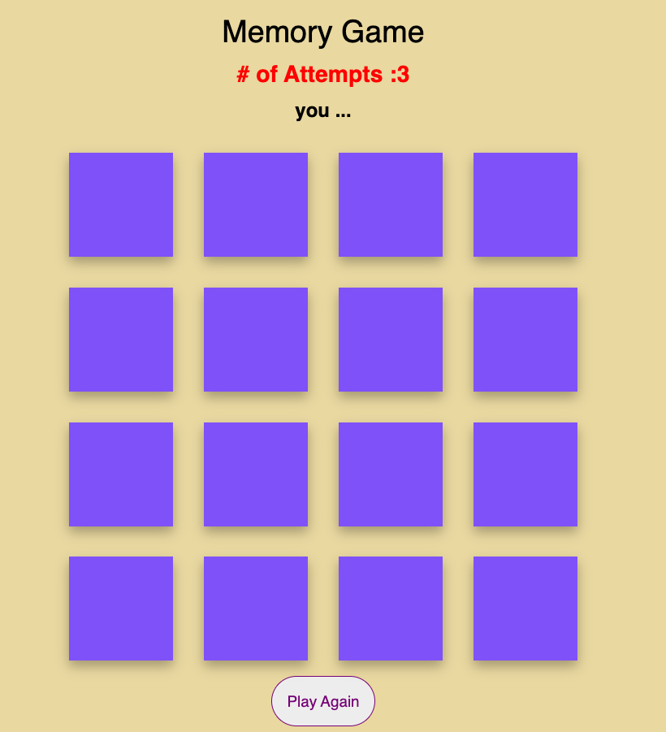

# memory_game
☐ <Memory Game>
	The game contains, in this case 16 cards animal themed. The cards are displayed facedown in rows and columns. The number of attempts displays how many tries you have left before losing.
	
	Februrary 1959, Memory Game was first published by Ravensburger. However, there were pre-existing versions dating back to the 16th century in Japan known as, asAwase or Kai-awase. These were matching pictures on painted shells.  

☐ Technologies Used: 
	JavaScript, HTML, CSS

☐ Getting Started:
	The object of the game is to collect all of pairs. You must select one card and then another to match the images. You lose the game if you choose the wrong matching cards more than three times, this is displayed as 'number of attempts'. Once you loose or win you may click the button Play Again to renew the game. 
<a href="https://adalawson96.github.io/memory_game/">Play Game</a>

☐ Icebox items:
	Add sound to the the cards when they match. 
	Have the Play Again button appear after winning or losing the game.

